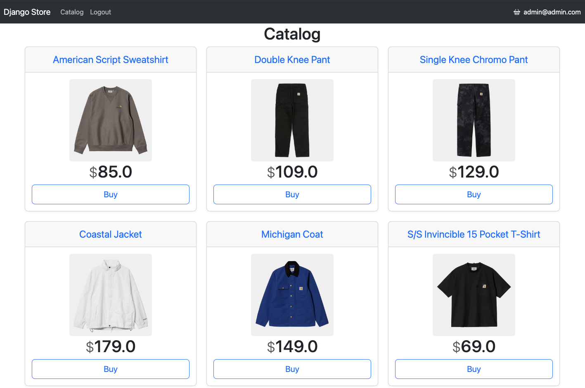

# Simple Online Store

The educational project built on Django. The project contains 3 apps: shopping_cart, authuser, and catalog.
<br>
## Getting Started
To get started with this project, clone the repository:
```
git clone https://github.com/razzzzzr/simple_online_store.git
```
Create a virtual environment and install the project dependencies:
```
cd simple_online_store
python -m venv env
source env/bin/activate  # for Unix/Linux
env\Scripts\activate  # for Windows
pip install -r requirements.txt
```
Create `config.yaml` file (see `config.example.yaml`).

Make and apply the database migrations:
```
python manage.py makemigrations
python manage.py migrate
```
Create a superuser account to access the admin panel:
```
python manage.py createsuperuser
```
Run the development server:
```
python manage.py runserver
```
The project will be available at http://127.0.0.1:8000/.
## Apps
### 1) authuser
The user authentication functionality. Email authentication implemented using the _AbstractUser_ class.
### 2) catalog
The app provides product catalog functionality, with all queries to the _Cart_ model encapsulated using the _ShoppingCartRepository_ class (Repository pattern). The implementation includes safe deletion of objects (_Product_ and _Category_ models) through the use of the _django-safedelete_ library, allowing for restoration of deleted objects through the admin panel.
<br>
### 3) shopping_cart
The shopping cart functionality.
<br>
## Testing
The project includes tests for all apps using the pytest library. To run the tests, activate the virtual environment and run:
```
pytest
```